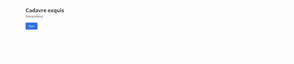
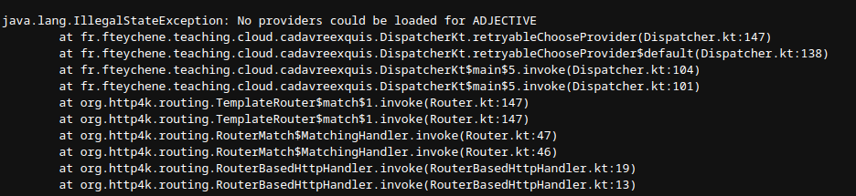
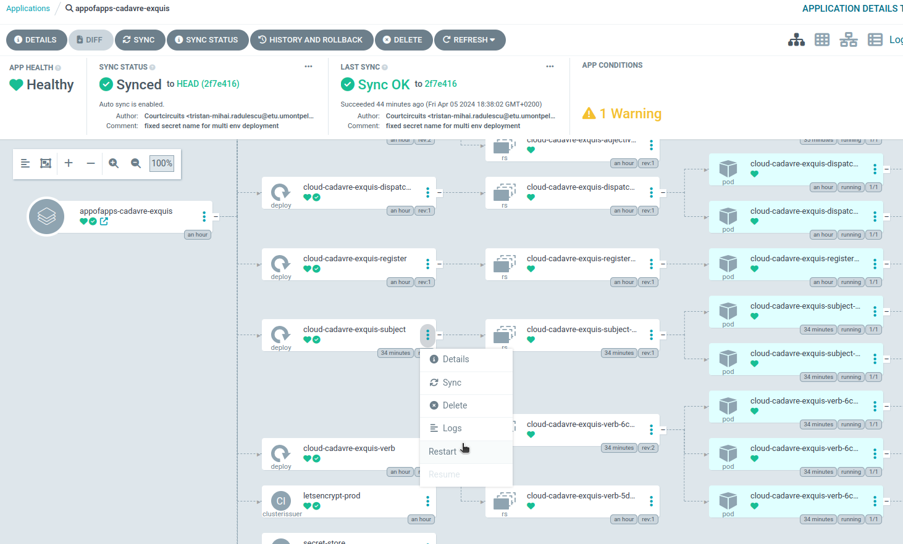
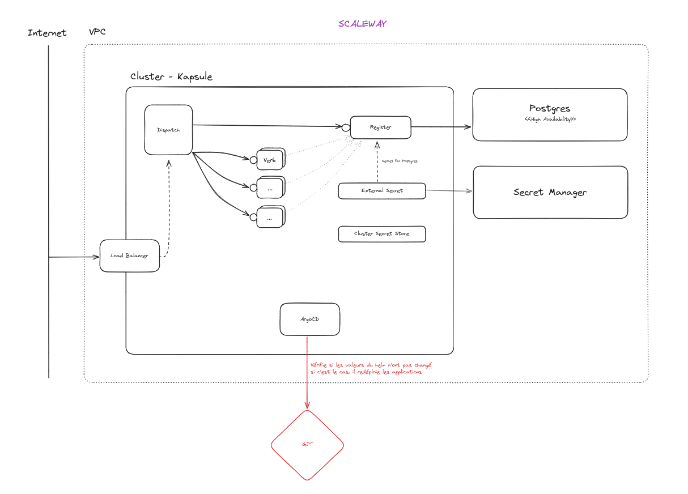
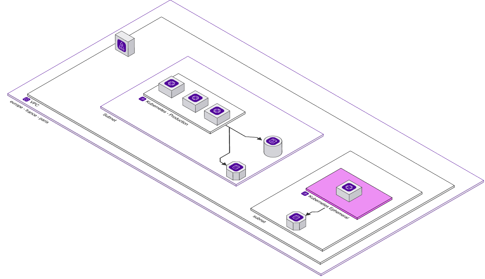

> Dorian Grasset - Tristan Radulescu - Nathael Bonnal

# Cadavre exquis

Bienvenue dans la documentation de déploiement d'infrastructure sur Scaleway à l'aide de Terraform. Cette documentation vise à vous guider à travers le processus de configuration et de déploiement d'une infrastructure cloud complète sur la plateforme Scaleway, en utilisant Terraform pour l'automatisation et la gestion del'infrasutrcture en tant que code.



# Prérequis

Avant de commencer le déploiement de votre infrastructure assurez-vous de disposer des éléments suivants:

-   Compte Scaleway: Vous devez disposer d'un compte Scaleway pour accéder à la console de gestion et créer de ressources.
-   Accès à l'API Scaleway: Obtenez vos clés d'API Scaleway pour pouvoir interagir avec les services via Terraform.
-   Terraform installé: Assurez-vous d'avoir Terraform installé sur votre machine locale. Vous pouvez le [télécharger](https://developer.hashicorp.com/terraform/tutorials/aws-get-started/install-cli) à partir du site officiel de Terraform.
-   Cloner le repo: Assurez-vous de disposer du projet sur votre machine afin de l'utiliser - [projet](https://github.com/418-Error/cloud-cadavre-exquis)

Cette documentation suppose que vous avez une certaine expérience avec Terraform ainsi qu'une connaissance générale des concepts d'infrastructure cloud.

## Configuration des Outils

Avant de commencer le déploiement, vous devez vos outils pour interagir avec Scaleway via Terraform. Cela implique la configuration de Terraform pour utiliser le provider Scaleway, ainsi que la gestion des variables d'environnements pour sécuriser l'accès à votre compte Scaleway.

### Configuration de Terraform pour Scaleway

L'ensemble de nos modules et dossier terraform se trouve dans `./terraform`

Voici un exemple de notre architecture
```
/terraform
├── 00.bucket_backend
│   ├── main.tf
│   ├── variables.tf
│   └── ...
├── 01.kosmos
│   ├── main.tf
│   ├── variables.tf
│   └── ...
├── ...
├── modules
│   ├── kapsule
│   │   ├── main.tf
│   │   ├── variables.tf
│   │   └── ...
│   ├── ...
│   └── ...
├── backend.tf
└── variables.tf
```


1. Installation de Provider Scaleway:
Tout d'abord, assurez-vous d'avoir la dernière version du provider Scaleway installée. Vous pouvez l'installer en exécutant la commande suivante :
```
terraform init
```


2. Configuration des Variables d'Environnement: Pour sécuriser l'accès à votre compte Scaleway, vous devez définir vos clés d'API Scaleway en tant que variables d'environnement ou dans un fichier de configuration Terraform. Vous pouvez définir ces variables d'environnement dans votre terminal, soit dans un fichier tfvars (équivalent du .env) ou avec un secret manager.

```bash
# terraform.tfvars

access_key = "SCW100000100010001"
secret_key = "SecretKey"
organization_id = "OrganizationId"
project_id = "ProjectId"
email = "nathael.bonnal@oomade.com"
```

## Exécution

Rendez-vous dans le dossier `terraform/00.bucket_backend` pour commencer le déployement.

# 00.Bucket_backend
Set up backend to share and save `terraform.tfstate` in an object storage.
## Launch the run
1. Go to the [IAM manager](https://console.scaleway.com/iam/api-keys) and generate a pair of API keys.
2. Execute the following command (these variables will be used to access the bucket you will create, ⚠ each time you'll want to launch a terraform run you'll have to fill these variables) :
```bash
export AWS_ACCESS_KEY_ID="<your-access-key>"
export AWS_SECRET_ACCESS_KEY="<your-secret-key>"
```
3. Create a `terraform.tfvars` file and fill it like this :
```
access_key = "<your-access-key>"
project_id = "<your-project-id>
secret_key = "<your-secret-key>"
```
4. Initialize the terraform run with `terraform init`
5. Set the environment to prod with the command `terraform workspace new prod`
6. Then run `terraform apply` and let the magic happen !

## What's next ?
Go to the run `01.vpc`
```bash
cd ../01.vpc
```

# 01.vpc
This run creates a virtual private cloud to host our future database and kapsule cluster.
## Prerequisites :
- you have to launch the `../00.bucket_backend` run before.
## Launch the run
1. run the following commands :
```bash
cp ../00.bucket_backend/terraform.tfvars .
terraform init
terraform workspace new prod
terraform apply
```
And let the magic happen !
## Troubleshoot
If there is an error related to backend/s3 bucket authentication, run the following commands.
```bash
export AWS_ACCESS_KEY_ID="<your-access-key>"
export AWS_SECRET_ACCESS_KEY="<your-secret-key>"
```
## What's next ?
Go to the run `02.kapsule`
```bash
cd ../02.kapsule
```

# 03.database
This run creates a database and adds secrets 
## Prerequisites :
- you have to launch the `../02.kapsule` run before.
- you will need the scaleway cli
## Launch the run
0. Update your kubeconfig with the scaleway cli.
```bash
scw k8s kubeconfig install "$SCW_CLUSTER_ID" --profile <your-auth-profile>
```
Note : You will need to provide your scaleway credentials in your `~/.config/scw/config.yaml` file like this : 
```
profiles:
  <your-auth-profile>:
    access_key: <your-access-key>
    secret_key: <your-secret-key>
    default_organization_id: <your-organization-id>
    default_zone: <your-zone>
    default_region: <your-region>
    api_url: https://api.scaleway.com
    insecure: false
```
Note 2 : Your kubeconfig must be at the path `~/.kube/config`. Else modify the terraform code.

1. run the following commands :
```bash
cp ../02.kapsule/terraform.tfvars .
terraform init
terraform workspace new prod
terraform apply
```
And let the magic happen !
## Troubleshoot
If there is an error related to backend/s3 bucket authentication, run the following commands.
```bash
export AWS_ACCESS_KEY_ID="<your-access-key>"
export AWS_SECRET_ACCESS_KEY="<your-secret-key>"
```
## What's next ?
Go to the folder `04.argocd`
```bash
cd ../04.argocd
```

# 04.argocd
This run creates argocd
## Prerequisites :
- you have to launch the `../03.database` run before.
## Launch the run
1. In your terminal launch the following commands :
```bash
cp ../03.database/terraform.tfvars .
terraform init
terraform workspace new prod
terraform apply
```
## Troubleshoot
If there is an error related to backend/s3 bucket authentication, run the following commands.
```bash
export AWS_ACCESS_KEY_ID="<your-access-key>"
export AWS_SECRET_ACCESS_KEY="<your-secret-key>"
```
## What's next ? 
Go to the folder `05.argocd-config`
```bash
cd ../05.argocd-config
```
# 05.argocd-config
This run will configure argocd by whitelisting the repositories, providing credentials to your repository and create application to manage by argocd.
## Prerequisites :
- you have to launch the `../04.argocd` run before.
- you will need the argocd cli.
- you will need the `kustomize` cli.
## Launch the run
0. Get the argocd password
```bash
kubectl get secret argocd-initial-admin-secret -n argocd -o jsonpath='{.data.password}' | base64 --decode
```
1. **In a new terminal (don't close your current terminal)**, port forward argocd to access it with the following command : 
```bash
kubectl port-forward service/argocd-server 8080:80 -n argocd
```
2. **Go back to your old terminal** and authenticate to argocd
```bash
argocd login localhost:8080
# WARNING: server is not configured with TLS. Proceed (y/n)? Type y
# Username: admin
# Password: <the-result-of-step-0>
```
3. Generate a github auth token here : https://github.com/settings/tokens. Make sure that your **classic token** has at least these rights : `project, read:public_key, repo, workflow`.
4. Create a new file `teraform.tfvars` and fill it like this :
```
argocd_repositories_config = [{
  password = "<your-classic-token>"
  url = "<your-repo-url>"
  username = "<your-user-name>"
  name = "<your-repo-name>"
}]
```
5. Run the following commands :
```bash
terraform init
terraform workspace new prod
terraform apply
```
## Post installation
6. After the run, run the commands :
```bash
./launch.sh
```
It will create the argocd applications and install all the CRDs.

7. Finally make sure that all your resources have been created by going to the address http://localhost:8080. Also you can go to your scaleway to make sure that your load balancer has been created.

## Configuration
Pour donner à l'application les informations nécessaire à son execution, rendez-vous dans le fichier `k8s/charts/apps/prod.yaml` et remplacez les champs suivant par les bonnes valeurs : 
```yaml
scaleway:
    projectId: "<your-scaleway-project-id>"

dispatcher:
    domain: "<your-domain-name>"
```

Pour configurer votre nom de domaine, récupérez depuis la console scaleway l'ip publique de votre Load Balancer.
Ensuite ajoutez le record suivant à votre zone dns :

```
<your-subdomain-or-domain>. <your-ttl>	IN	A	<your-load-balancer-ip>
```

## Troubleshoot
Il y a de grandes chances que vous obteniez une erreur semblable lorsque vous accédez à l'application.

Pour régler ce problème. Rendez-vous dans argocd et redémarrez les `deployment` correspondant.



## Ajouter un environnement
Vous pouvez ajouter autant d'environnements que vous voulez en allant dans chaque terraform et en faisant la commande : 
```
terraform workspace add <your-new-env>
```
Ensuite il faudra se rendre dans `terraform/05.argocd-config/applications`, dupliquer le dossier `prod` et modifier chaque occurence du mot `prod` par le nom du nouvel environnement.

Enfin, il faudra se rendre dans `k8s`, dupliquez le dossier prod et personnalisez le pour qu'il corresponde aux besoin du nouvel environnement.
Finalement rendez-vous dans `k8s/charts/apps`, dupliquez le fichier `prod.yaml` et personnalisez de la même manière que précédemment.


## Architecture





# Common

| Env Var       | Description            | Default     |
| ------------- | ---------------------- | ----------- |
| `INSTANCE_ID` | Define the instance id | Random UUID |
| `APP_ID`      | Application id         | `""`        |

### Dispatcher

| Env Var         | Description                                     | Default |
| --------------- | ----------------------------------------------- | ------- |
| `PORT`          | Http port to listen to                          | `8080`  |
| `REGISTER_URLS` | Url to call registers on (list splitted by `,`) | N/A     |

### Register

| Env Var                     | Description                        | Default |
| --------------------------- | ---------------------------------- | ------- |
| `PORT`                      | Http port to listen to             | `8080`  |
| `STORAGE`                   | Define storage target (PG, MEMORY) | `PG`    |
| `POSTGRESQL_ADDON_HOST`     | Postgresql host                    | N/A     |
| `POSTGRESQL_ADDON_PORT`     | Postgresql port                    | N/A     |
| `POSTGRESQL_ADDON_DB`       | Postgresql database to use         | N/A     |
| `POSTGRESQL_ADDON_USER`     | User for postgrsql connection      | N/A     |
| `POSTGRESQL_ADDON_PASSWORD` | Password for postgrsql connection  | N/A     |

### Provider

| Env Var          | Description                                                               | Default                     |
| ---------------- | ------------------------------------------------------------------------- | --------------------------- |
| ` PORT`          | Http port to listen to                                                    | `8080`                      |
| `REGISTER_URLS`  | Url to call registers on (list splitted by `,`)                           | N/A                         |
| `PROVIDER_TYPE`  | Define the provider type of the instance (`VERB`, `ADJECTIVE`, `SUBJECT`) | Random in possible values   |
| `ADVERTISER_URL` | Define the url sent to registers when starting                            | `http://<detectedip>:$PORT` |
